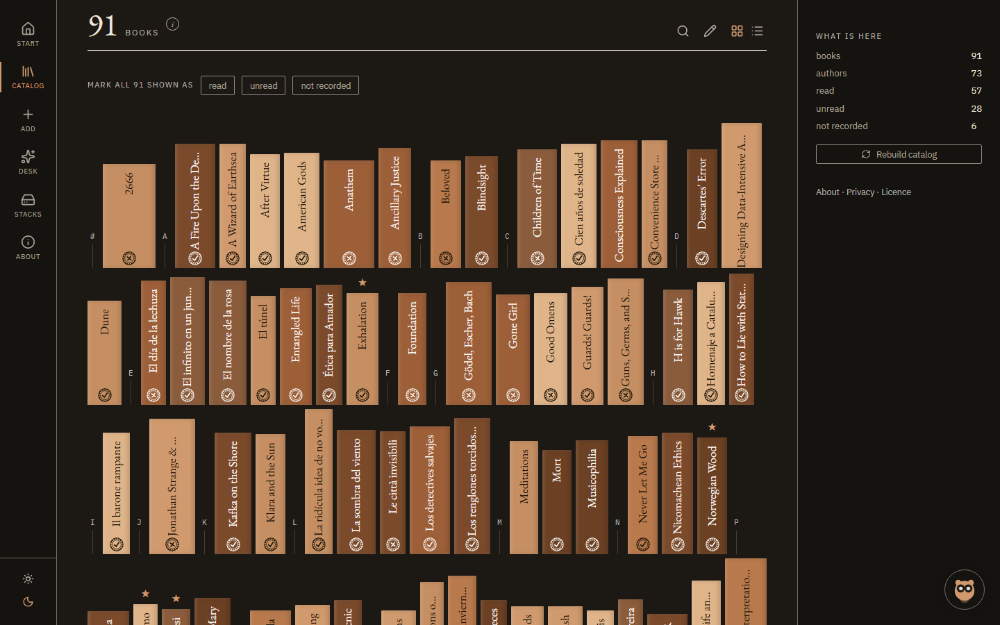
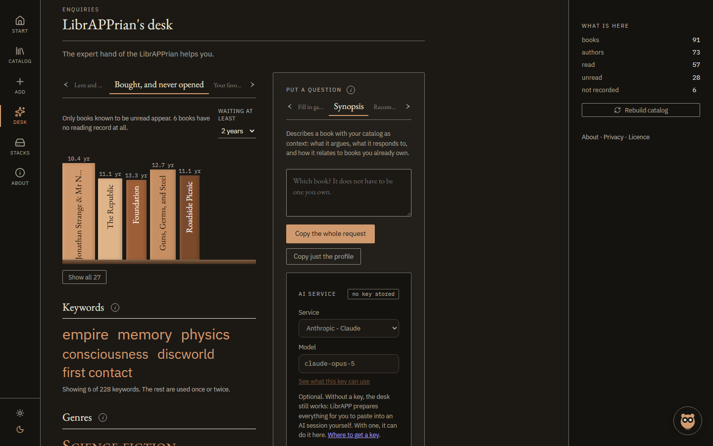
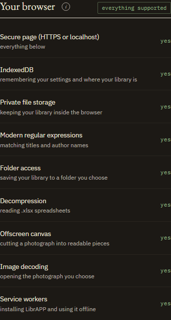
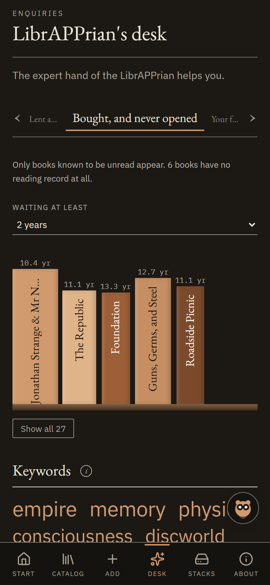
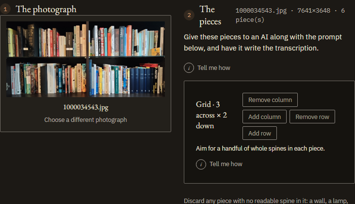
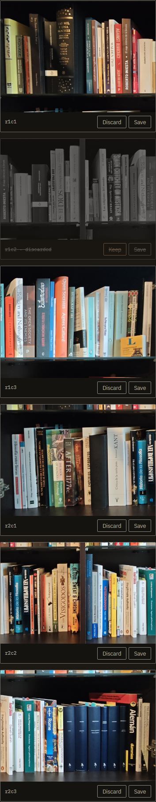
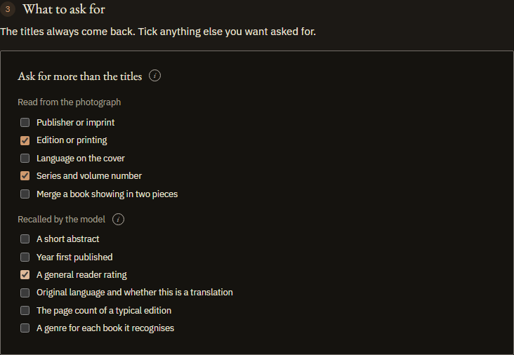
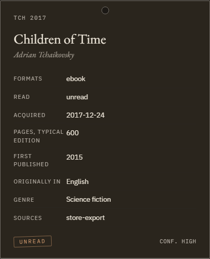
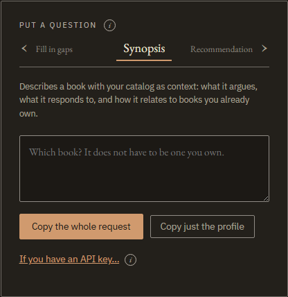

# LibrAPP

[](https://github.com/JesusJBallesteros/LibrAPP/actions/workflows/tests.yml)
[](https://github.com/JesusJBallesteros/LibrAPP/actions/workflows/pages.yml)
[](LICENSE.md)

### Photograph your shelves. Get a catalog that answers questions.

[](https://jesusjballesteros.github.io/LibrAPP/#demo)

## → [**See it with books in it**](https://jesusjballesteros.github.io/LibrAPP/#demo) ←

That link opens a working library of 91 invented books: browse the shelf, open a
book, ask the desk something. Nothing to install, nothing to sign up for, nothing
saved to your device. Reload and it is gone.

When you want your own in it, [**open LibrAPP**](https://jesusjballesteros.github.io/LibrAPP/)
and photograph a shelf.

---

**Point a camera at a bookcase.** LibrAPP cuts the photograph up on your device
and reads the spines into a catalog you can search, filter and browse. Bring in a
spreadsheet or a barcode as well, and the same book arriving from three places
becomes one entry rather than three.

**Then ask it things.** The [LibrAPPrian's desk](#the-desk) takes your own
shelves as context: what to read next and why, which books by an author you have
collected unevenly are missing, what threads run through what you own, a list for
a long flight. The answers are about your books, not about books.

**It also tells you things you did not ask.** Which books you bought years ago
and never opened, ranked by how long they have waited and by how much you
evidently wanted them at the time. What is lent out and to whom. What the
collection keeps coming back to.



**Your books stay on your device.** No account, no server, no sync. It works
offline once loaded and installs as an app on Windows, Linux, Android and, by
Add to Home Screen, on an iPhone. Three
optional steps can send something, all of them listed [below](#about-privacy-and-version), and each
shows you what it is sending first.

The interface is in English and Spanish, chosen on the opening page.

---

## Contents

- [What it does](#what-it-does)
- [Language](#language)
- [Browser support](#browser-support)
- [Getting at it](#getting-at-it)
- [Install](#install)
- [Adding your books](#adding-your-books)
- [Using the catalog](#using-the-catalog)
- [Favourites and notes](#favourites-and-notes)
- [Corrections](#corrections)
- [Lending and borrowing](#lending-and-borrowing)
- [The desk](#the-desk)
- [Where your library lives](#where-your-library-lives)
- [Optional AI key](#optional-ai-key)
- [About, privacy and version](#about-privacy-and-version)
- [How this was built](#how-this-was-built)
- [Command-line tools](#command-line-tools)
- [Development](#development)
- [Licence](#licence)

---

## What it does

| | |
|---|---|
| **Import** | shelf photographs, spreadsheets, CSV, barcodes |
| **Merge** | the same book from several sources becomes one entry, not duplicates |
| **Browse** | search, filter and group offline — no network, no waiting |
| **Correct** | edit or remove any entry; corrections outlast every rebuild |
| **Ask** | recommendations, synopses and reading lists, with your own shelves as the context |
| **Complete** | ask for the details the catalog is missing, and see them before they are kept |
| **Mark** | star the ones that matter and write your own notes, which the desk then reads |
| **Track** | who has the book you lent, and whose book you are still holding |

Two steps use AI: reading spines off a photograph, and asking the desk a
question. Both work without a key, by preparing the request for you to paste into
any AI session yourself, and both show what a request will cost before it is
sent. Everything else, meaning importing, merging, searching and filtering, is
plain code running locally. You choose which service to use and pay for it
directly.

---

## Language

LibrAPP is available in **English** and **Spanish**.

Adding a language:  add one file next to
[`web/src/i18n/en.js`](web/src/i18n/en.js) and listing it in
[`web/src/i18n/index.jsx`](web/src/i18n/index.jsx). Any key you leave out falls
back to English, so a partial translation still works.

---

## Browser support

| Engine | Browsers | Everything works? | Checked |
|---|---|---|---|
| **Chromium** | Chrome, Edge, Brave, Opera, Vivaldi, Arc, Comet, Samsung Internet | Yes | Chrome on Windows 11 and Android |
| **Gecko** | Firefox 113+ | Should, except saving to a folder and installing as an app | Not yet |
| **WebKit** | Safari 16.4+, all iOS browsers | Should, except saving to a folder; install via Add to Home Screen | Not yet |

The last column is the honest one. Firefox and Safari meet every requirement
listed below, so there is no known reason for them to fail, but *meets the
requirements* is a reading of the documentation and not a test result. If you
use one of them, the next section is the answer that does not depend on this
table.

Only Chromium browsers on a desktop can save your library to a folder you
choose; everywhere else it goes into browser storage, which works identically
from inside the app but is not visible to other programs. See [where your
library lives](#where-your-library-lives).

**Not sure about yours?** Open LibrAPP and go to **The stacks → Your browser**. It
tests each feature and tells you what works, which is more reliable than any
table — including this one.



### If you use strict privacy settings

Brave's Shields, Firefox's strict mode and similar features do not stop LibrAPP
working. But **anything set to clear site data when you close the browser will
delete a library kept in browser storage.** If you use those settings:

- prefer saving to a folder (Chromium desktop), or
- allow LibrAPP's storage as an exception, or
- keep an export — **The stacks → Export**.

LibrAPP warns you when its storage is not marked persistent.

### Tested on

Chrome on W11 and Android. Firefox and Safari meet the
requirements below but are untested. If something breaks in yours, please
open an issue.

Internet Explorer and browsers older than the versions above are not supported.

<details>
<summary>What LibrAPP needs from a browser</summary>

| Feature | Used for | Without it |
|---|---|---|
| Secure context (HTTPS) | everything | nothing works |
| IndexedDB | settings and where your library is | nothing works |
| Origin Private File System | keeping the catalog | nothing works |
| Regex lookbehind and Unicode escapes | matching titles and names | nothing works |
| File System Access API | saving to a folder you choose | browser storage is used instead |
| `DecompressionStream` | reading `.xlsx` spreadsheets | CSV still imports |
| `OffscreenCanvas`, `createImageBitmap` | tiling a photograph | import from a list instead |
| Service workers | installing, and offline use | runs online only |

</details>

---

## Getting at it

LibrAPP is built to be used by keyboard and by screen reader, not only by mouse
and eye. It is checked against WCAG 2.2 rather than guessed at, and the colour
arithmetic is measured by its own tests, so a later change to the palette has to
fail there before it can ship.

**Contrast is not a setting.** The palette everyone gets is the raised one:
quiet text reaches 7:1, which WCAG calls the enhanced level, and the hairlines
between rows are drawn as strongly as the boundary of a control, since at low
vision the structure of a page matters as much as the words. There used to be a
switch offering a lower level; there is nothing to switch to now.

**By keyboard**, a skip link is the first thing Tab reaches, past the sidebar
and into the catalog. The book panel is a real dialog: it takes focus when it
opens, keeps it while open, closes on Escape, and hands focus back to the row
you opened. The current page is marked as such, and the page title names the
view you are on.

**Everything that carries meaning carries it in words as well.** Read state is
written out, not only coloured. The genre chart is labelled and every slice is
named and counted in its legend. Spines keep their titles as their accessible
names, and word cloud entries say how many books use each word.

Nothing moves for anyone who has asked their system for less motion.

If something here does not work for you, that is a bug and worth
[reporting](https://github.com/JesusJBallesteros/LibrAPP/issues).

---

## Install

You do not have to install anything —
[the app](https://jesusjballesteros.github.io/LibrAPP/) runs in the browser. But
installing gives it its own icon and window, and makes offline use reliable.

**On your phone**, the front page offers to install where the browser supports
being asked, and writes out the manual route where it does not: on an iPhone,
*Share* then *Add to Home Screen*; on Android, the browser menu then *Install
app*. Both do the same thing.



**Your catalog does not travel with it.** Each device keeps its own, so moving
one across is a file: export it in **The stacks** on one device, and bring that
file in on the other. A backup works for this too, since a backup is the same
file.

### Running your own copy

LibrAPP is a static site. Build it and serve the `web/dist` folder from
anywhere — a local server, a static host, GitHub Pages.

```bash
cd web && npm install && npm run build
```

Requirements: Node 20+ to build. Nothing to run it.

---

## Adding your books

The opening page asks what you have rather than asking for your storage.
Arriving with nothing, there are three ways in: a photograph of a shelf, a list
you already keep, or the barcodes on the books themselves. Once there is a
catalog here, opening it and bringing one over from another device join them.

Whichever you pick sets up storage on the way, so choosing where the catalog is
kept is a decision you can make first if you want to and never have to make on
your own.

You need at least one source. Any one of these is enough on its own.

Every one of them ends in a list to check before anything is written, and any
single line of that list can be **discarded** on its own. Everything is kept
unless it is set aside.

### A photograph of a shelf

Photograph the shelf straight on at your camera's **full resolution**.

1. Open **Shelf picture** and choose the photo. It appears in the box you
   chose it from, and that box is also how to swap it for a different one. On a
   phone, **Take a photograph** beside the box opens the camera instead.



2. LibrAPP cuts it into pieces at full resolution. A close-up of a few books
   stays whole; a wide bookcase is split into several pieces. **Add row**, **Add
   column** and their opposites change the grid if the default does not suit
   your shelf.
    The key box at the top is optional and the page works without it. Everything up
    to this point has happened on your device: the photograph has been read, sized
    and cut, and nothing has been sent anywhere.
3. Check the pieces. Any that hold no readable spine, a wall, a lamp, the edge
   of a rug, can be **discarded**: they are not sent and not counted in the cost.
4. Read the pieces:
   - With an [AI key](#optional-ai-key): press **Read them**.
   - Without one: press **Copy the instructions**, save the pieces, and give
     both to any AI assistant. Bring back the JSON it writes.
5. Check what it read, then import.

**Step five takes the reply either way.** Drop the JSON file, or paste the text
straight into the box under it and press **Use this text**. It needs no key and
no photograph loaded, so coming back to it in a fresh tab works: it is the whole
of the keyless route's second half.



One piece here holds no readable spine and has been set aside. Discarded pieces
are not sent and not paid for, and **Keep** puts one back.



The checklist decides what is asked for beyond the titles, split into what is
printed on the spine and what the model would be recalling from elsewhere.
Anything recalled is marked on the book afterwards.

A long shelf is read in several requests rather than one, four pieces at a time,
and the button says which is running. One reply covering forty pieces is longer
than any model will return in one go, and a reply that runs out of room comes
back unreadable rather than short. If one of those requests fails, whatever the
others read is still offered, with the missing pieces named so a partial reading
is never imported as though it were the whole shelf.

Aim for pieces showing a handful of whole spines with the title readable top to
bottom. Adding **rows** splits titles in half, so only do that when the photo
really shows shelves stacked above one another.

Any piece holding no readable spine, such as a wall or a lamp, can be
**discarded** before the read. Discarded pieces are not sent, not saved and not
counted in the cost.

**What comes back is a list to check, not an import.** When the reading
finishes, the page says how many books came back and moves to the list, so a
read that takes a minute does not end on a page that looks unchanged. Nothing is
written until *Import these* is pressed, and any single book on the list can be
**discarded** first: a DVD case read as a book, a spine the model guessed at,
one wrong line in a reading that is otherwise right. Everything is kept unless
it is set aside, and the count on the button follows what is left.

### Asking for more than the titles

Under the pieces is a checklist of things to request beyond the titles, and it
divides into two kinds that are not interchangeable.

**Read from the photograph** — publisher, edition, the language on the cover,
series and volume. These are printed on the spine, so the model is transcribing
and the answer is evidence of the same kind as the title itself.

**Recalled by the model** — a genre, a short abstract, the year first
published, a reader rating, the original language, and the page count of a
typical edition. **None of this is in your photograph.** The model
produces it from what it was trained on, so it can be confidently wrong about a
real book. LibrAPP marks every book carrying such a field, shows the mark on the
book, and counts them before you import. The mark comes from which fields are
actually present, so a model cannot report a recalled abstract as something it
read.

Ticked boxes apply to both routes: the request sent with a key and the text the
copy button produces are the same string.

Cover images are not offered. A model replying with JSON can only return a link,
and fetching one would put a network request into an app that makes none, and
would tell whoever hosts that image which books you own.

The page count is worth a word of its own, because it is a number and numbers
look measured. It is the length of a typical edition of that work, not of the
copy in your picture. Nothing on a spine states a page count, so it is recalled
like the rest, and it is labelled that way wherever it appears.

A photograph shows a title, usually an author, sometimes a publisher. It cannot
show when you bought a book or whether you read it, so those stay blank until
another source fills them in.

Anything you do not tick here can be asked for later at the desk, for books
already in the catalog. See [Filling gaps](#filling-gaps-in-the-records).

### A list you already keep

Open **Upload list** and drop in a `.xlsx`, `.csv` or `.tsv` file.

Columns are matched by name in English, Spanish and German, so a sheet headed
`Autor / Título / Género` works as well as `author / title / genre`. Recognised
columns include title, author, genre, keywords, series, volume, publisher,
acquired date, read status, format and location. Unrecognised columns are
ignored.

If a file holds more than one list, LibrAPP asks which one you want before
importing anything.

**The rows are shown before anything is written.** LibrAPP lists what it read
out of the file, and any row can be **discarded**: a header line that parsed as
a title, a wishlist entry sitting among books owned, anything in the sheet that
is not a book. Everything is kept unless it is set aside.

### Books on a Kindle

Amazon ships no export button, and for a lot of people the Kindle is the largest
collection they own. **Books on a Kindle**, on the front page, gives two routes
and says what each one costs.

**Ask Amazon for the data.** Account, then Data Privacy, then Request Your
Information. A download link arrives by email, usually within a few days. It
carries more than the other route, purchase dates included; its columns are not
recognised yet, so point them at the right fields in step two of Upload list.

**Read the list off the page yourself.** A short script, kept in
[`tools/kindle-library-exporter/`](tools/kindle-library-exporter) and shown on
that page from the same file, saves the library page as a CSV. It makes no
network request and touches nothing but the page in front of it.

The page carries a plain warning about the second route, and it is meant
seriously: pasting code into a console on a site where you are signed in is how
accounts get stolen, and nobody should do it because a website asked. The code
is short so that it can be read first.

Either route gives you the title, the author and Amazon's own number for each
book. Not the purchase date, the read state, the page count or the ISBN. Step
five of Upload list can look some of that up afterwards, and finds more for
books in English than for books in other languages.

### Reading barcodes

The number under a barcode identifies the exact edition, so where **[Open
Library](https://openlibrary.org)** holds that edition there is nothing to guess
at: the title, the authors, the publisher, the year and the page count come back
as recorded facts. No AI, no key and no cost.

Open Library is a free catalogue run by the Internet Archive, and it is the one
service LibrAPP asks anything of. What it is sent is a list of ISBNs and nothing
else.

Paste the codes, one per line or out of a spreadsheet column, or read them from
a file. Hyphens, spaces and ISBN-10s are all fine, and the same book written as
a 10 and a 13 is looked up once.

**Or point the camera at them.** *Scan with the camera* opens a viewfinder and
reads codes as they pass in front of it, which is the quick way through a stack:
hold each book up, watch the count go up, move on. The same book twice counts
once. The camera is asked for only when you press it and handed back the moment
you stop, leave the page or switch tabs.

**Or photograph the barcodes.** Where the browser can read one, and Chrome on
Android can, **Read a barcode from a photo** takes one picture or several and
adds what it finds to the same box. A photograph of a pile gives up every code
in it, and a barcode that is not a book fails the same check a typo does. The
picture is read on the device at its own resolution and never leaves: shrinking
it would throw away the lines that carry the data, and there is nothing to save
by shrinking something that is not being sent.

Chrome on Android has a barcode reader built in and uses it. Desktop browsers
have none, so LibrAPP carries its own: about a megabyte of compiled decoder,
fetched the first time you scan something and not before. It is served from
LibrAPP itself, like the fonts, so scanning still makes no third-party request.
The page says which of the two is in use.

**What comes back is shown before any of it is kept**, for a reason worth
knowing. Asked for an ISBN it does not hold, the service answers with a
different book rather than with an error, so one wrong digit does not fail, it
succeeds wrongly and hands back a title with a publisher and a page count
attached. A code whose own check digit disagrees is refused before anything is
sent, which catches a mistyped or transposed digit, and you catch the rest by
reading the list.

A book already on your shelf takes the new details rather than becoming a second
entry: a lookup is a source like a photograph or a spreadsheet, and the same
merge applies. Anything that matched nothing is added. **The review says which
is which** before you keep anything, so a batch of thirty tells you how many are
new books and how many are gaps being filled. Any line of it can be
**discarded** on its own, so one wrong code among twenty right ones costs one
line rather than the batch.

Subjects come back as **keywords**, not as a genre. There are twenty to ninety
of them per book and they include things like *American literature* and *New
York Times reviewed*; calling one of them the genre would be the app choosing
rather than recording.

### Typing a book in

Press **Type a book in** from the catalog for anything the other sources cannot
see — a gift, a borrowed book, something read but not owned.

Typed entries merge with the same book from other sources rather than
duplicating it.

---

## Using the catalog

**Search** opens the controls: search across titles, authors, series and tags,
filter by read status, format, source, whether a book is away from the shelf and
whether you marked it a favourite, and group and sort the result.

They stay folded until you press it, and while they are folded the button
carries a count of anything still narrowing the list, so a shelf that looks
short always says why.

**Mark many books at once.** Under the count is *Mark all N shown as read /
unread / not recorded*, which applies to every book the search and filters have
left on screen. It asks first and names the number, and each one is a correction
like any other, so any of them can be undone.

**The catalog opens as a shelf.** Spines draws the filtered books standing
side by side; **List** is one button away and is where searching and sorting are
easiest to read.

**Thickness is the one real measurement.** It comes from the page count, in
three bands: under 150 pages is thin, 150 to 300 is medium, over 300 is thick.
A book with no page count recorded is drawn at the middle width, because nothing
is known about it and drawing it thin would be inventing a fact. Page counts
arrive from the extras checklist while a photograph is read, or from **Fill in
gaps** at the desk.

**Height and colour are decoration, and the wall says so underneath.** Height
comes from the length of the title, so a tall spine means a long name and not a
big book. Colour is fixed per book so a spine keeps its own. Titles are set at
one size on every spine, large enough to read across a room, and a title longer
than its spine ends in an ellipsis. The whole title is always in the tooltip and
in the accessible name.

**Every book that has been answered for carries a stamp** at the foot of its
spine: a ring with a check in it for read, the same ring with a cross for
unread. A book nobody has recorded is left bare, which is what makes that state
readable from the shelf at all.

**Point at a spine, or tap one on a phone, and it offers both.** Read and unread
as one choice, and the star. Pressing the state a book is already in puts it
back to not recorded.

**Switch between Day and Night** from the sidebar, or leave it alone and it
follows whatever your system asks for. The landing page has it too.

**On a narrow screen** the sidebar folds behind a **Menu** button and opens on
a press. Choosing a page closes it again.

**Click any book** for the full record: series and volume, formats, purchase
date, publisher, genre and tags, where it is shelved, which sources know about
it, and how confident LibrAPP is about the entry.



**The record asks for what nothing else can tell it.** Read state, a loan and a
note have to come from you: no photograph, spreadsheet or lookup knows whether a
book was read, who has it, or what you thought of it. A book missing any of the
three lists them under *Still to record*, and each opens the form at its own
box.

### Read status has three values

| | |
|---|---|
| **read** | a source recorded it as read |
| **unread** | a source recorded it as unread |
| **not recorded** | nothing has ever said either way |

### Confidence

| | |
|---|---|
| **high** | from a machine-readable source, checked against its own count |
| **medium** | transcribed by eye or by a model — a photograph, a hand-kept list |
| **low** | a guess, or a placeholder for something illegible |

A source declares how far it is trusted, and its rows start from there. Two
checks can lower a row below its source, never raise it, because a tidy file can
vouch for its own format and not for what somebody typed into it:

- A title standing in for something nobody could read, whether the whole title
  is a note in brackets or it starts with one and carries on, drops to **low**
  and is marked as a stand-in to re-photograph.
- An author column holding a word rather than a name, such as *Reference*,
  *Various*, *VV.AA.*, *Unknown* or the catalogue abbreviations *s.n.* and
  *s.a.*, drops the entry to **medium** and says so. A book that honestly has no
  personal author, like a reference work or an anthology, is recorded as such and
  is not doubted for it.
- The publisher's name sitting in the author column drops it to **medium** too.
- A first-published year that has not happened yet does the same. Only the
  future is doubted: that field is when the work first appeared, so an ancient
  text with a year of 180 is right and is left alone.

When two sources disagree, the more reliable one wins on facts it can know. A
spreadsheet knows the purchase date; a photograph does not. Judgements like
genre come from whichever source recorded one.

---

## Favourites and notes

Two things in a record come from nobody but you. Everything else arrives from a
spine, a spreadsheet or a model.

**The star.** Open any book, press Edit, and mark it. Starred books show the
star in the list and on the card, filter on their own, and get a section at the
desk.

**The note.** The same form has a box for whatever you want to say about the
book. It is not a summary and it is not for the catalog's benefit. "Bought in
Lisbon, never got past chapter three" is a perfectly good note.

Both live in the corrections layer, so they survive every rebuild and can be
undone one book at a time. See [Corrections](#corrections).

### The LibrAPPrian reads them

This is the point of both. When you ask the desk anything, LibrAPP sends a
profile of your reading with the question, and that profile now carries every
star and every note, quoted in your own words under a heading that says they are
yours rather than a description of the book.

The prompts say plainly that these outrank the counting. Genre totals are what
is left when nobody has said anything; a starred book and a sentence you wrote
are you saying something outright. Where the two disagree, the answer is meant
to follow you.

Practically: a shelf of ninety history books and one starred volume of poetry
will not be told to buy more history. Three notes complaining that a subject was
handled badly are a stronger signal than a genre count, and they are the kind of
thing no amount of counting would reveal.

Neither field is required, and the desk works without them. They are simply the
cheapest way to make the answers better.

---

## Corrections

Anything LibrAPP got wrong can be fixed, and the fix outlasts every rebuild.

**Edit** any entry from its detail panel. Only the fields you actually change
are recorded, so later improvements to your sources still reach the rest of the
entry. A corrected entry says so, shows what it said before, and can be undone.

**Remove** an entry to take it out of the catalog. Because the catalog is
rebuilt from your sources every time, a removal is stored as a decision rather
than a deletion — otherwise the next rebuild would bring the book straight
back.

Everything you have corrected is listed under **The stacks → Corrections you have
made**, where removals can be restored and edits undone.

Three other things land here, because they are corrections in the same sense:
your stars, your notes, and anything the desk fills in when you accept it. A
desk entry carries the reason *recalled by a model at the desk, not read from
any source*, and the notice on the book says it was changed after the sources
were read rather than corrected by hand, because it was not.

---

## Lending and borrowing

Open a book, choose **Edit**, and record who has it under *Away from the shelf*.
Two states, and a book can only be in one of them:

- **Lent to** somebody. The book is yours and it is not here.
- **Borrowed from** somebody. The book is here and it is not yours.

The date is optional, because it is the part people forget. A loan with no date
is kept and simply sorts last.

The catalog gains a **Where** filter for books on the shelf, lent out or
borrowed, and rows carry a pill for each. The desk lists what is away and how
long it has been gone, and the reader profile names those books, so a
recommendation does not suggest something that is currently at a friend's house.

Loans are stored with your [corrections](#corrections), which means they survive
every rebuild and travel with an export.

---

## The desk

The **LibrAPPrian's desk** is the half of LibrAPP that a spreadsheet cannot do.
A catalog tells you what you own. The desk reads the shape of it and answers
from that, which is why the answers are about your books rather than books in
general.

### What it shows you without being asked

Three shelves, one at a time. The arrows move between them, and so do the names
either side. All three are drawn as spines, and any book on one opens the same
panel the catalog opens, so it can be read, corrected or removed without going
looking for it.

**Bought, and never opened** — books you own and have not read, ordered by how
long they have waited and weighted by how much you evidently wanted them at the
time: filing a book into a collection, or putting it on several devices, is a
record of intent that a purchase date alone is not. Only books *known* to be
unread appear. The years each has waited sit above its spine.

**Your favourites** — the books you starred, with a link through to the same
filter in the catalog. See [Favourites and notes](#favourites-and-notes).

**Lent and borrowed** — what you lent and to whom, what you borrowed and from
whom, with the name above each spine. See
[Lending and borrowing](#lending-and-borrowing).

**Genres** — the largest genres as a share of the whole, with the long tail
grouped as *other*. Genre labels come from your sources and are not a controlled
list, so the chart says how much of the collection the named genres actually
cover. Genres are matched ignoring case and accents, so one written two ways is
one slice, named by whichever spelling your shelf uses most. **Name more
genres** opens it up from five to eleven, slices and legend together, and
appears only when there is a tail to open up.

**Keywords** — the words used by more than two books, drawn larger the more
often they appear. Pick one to open the catalog filtered to it.

### What you can ask it

Six requests, one at a time on a row that wraps at both ends. The arrows move
along it, and the faint names either side are pressable too.

**Synopsis.** Any book described to somebody whose shelf is already known: what
it argues, where it sits, what it does that the books you own do not, and
whether reading it would give you anything the shelf does not already have. The
book does not have to be one you own.

**Recommendation.** Two or three books, never more, each with the book on your
shelf it follows from or argues with. It is told to read the trajectory rather
than the pile, to consider your unread books before suggesting a purchase, and
not to recommend by resemblance.

**What to read next.** Chosen from the books you already own, for the week you
describe: a long flight, a free evening, something short, something that is not
a novel. Nothing to buy.

**Read the shelf.** The collection described to the person who built it. This is
the one request that answers with nothing typed into it, since the collection is
already in the profile. A box is there if you want a particular angle.

**Quick question.** Your own words, sent with your catalog attached and no
framing beyond it.

**Fill in gaps.** Described below. Unlike the others, this one writes to your
catalog, and only after you have seen what it wants to write.



### Keeping an answer

An answer appears below the box and the page moves to it. **Keep this answer**
writes it to `answers.json` beside the catalog, and the ones kept are listed at
the bottom of the desk behind **See them**, newest first, each with the question
it came from and the date. Delete one from there.

Kept answers are not part of the catalog. A rebuild does not touch them, a reset
leaves them, and an export does not carry them: a bundle is what a catalog is
built from, and an answer is not a source. To move one, copy it.

### What it knows when it answers

**You can read every byte of it before any of it is sent.** At the bottom of the
desk, **Your reading profile** prints the exact block that would go to a model,
with its character count and a scrollable preview, and **Copy just the profile**
puts that text on your clipboard and nothing else. There is no separate summary
of what is sent, because that block *is* what is sent. If you would rather not
send it from here at all, copy it and paste it into an AI session yourself: the
keyless route exists for exactly that.

LibrAPP builds a profile of your reading and sends it with the question. In v2
that profile carries:

- **The counts.** How many books, how many read, how many never recorded.
- **What the collection is made of**, and how that has changed between the
  earliest quarter of your buying and the most recent.
- **The shape of the shelf** — how long the books tend to be, when they were
  first published, what languages they were written in, how they are rated.
  None of this can be inferred from titles.
- **What the catalog records** — how much of each field is actually filled in,
  so a field blank across your whole shelf reads as *nobody has recorded this*
  rather than as an answer of no.
- **A cross-section** of the books themselves, described below.
- **Your favourites and your notes**, in full.
- **What is out of the house**, so nothing at a friend's is recommended.

#### The cross-section

Naming every book would crowd out the question and be paid for on every
request. Naming the thirty most recent would describe the last two years and
imply the shelf began then.

So the sample is proportional. Each genre gets a share of the slots matching its
share of the shelf, the books carrying the most information go first within a
genre, and anything you starred or wrote about is always included whatever its
genre's share. It is the same every time for the same catalog.

The prompts are told this is a sample, so absence from it is never treated as
proof you do not own something.

### Filling gaps in the records

The extras checklist is offered once, while a photograph is being read. Anything
you did not tick then was lost until the photograph was read again, which for a
catalog built from a spreadsheet never happens at all.

**Fill in gaps** asks for the same fields later, for books already on the shelf.

1. Tick the fields you want, or tick everything at once. Genre, series and
   volume, publisher, first published, pages, rating, original language and
   abstract. Each says how many books are missing it.

   The fields only you can know are deliberately absent: whether a book was
   read, when it was bought, where it sits, what you thought of it, who has it.
   So are the title and the authors, which identify the entry rather than
   describe the work.
2. The panel says how many books the request covers. The cost goes up with that
   number, so it is stated before anything is sent.
3. Send it, or copy it and paste the answer back if you have no key.
4. **What came back is shown before anything is written.** Not as text: as a
   count of how many books are affected and which fields actually came back,
   over the list of books themselves. A request asking for five fields commonly
   returns three. Keep it or discard it.

What it will not do:

- **It will not overwrite anything.** This fills gaps. A value already recorded
  came from somewhere, and this is not the thing to replace it.
- **It will not write silently.** Nothing reaches the catalog that you have not
  seen listed, book by book, field by field.
- **It will not keep what it cannot verify.** A value of the wrong type, a book
  it does not recognise, a field you did not ask for: all discarded, and the
  count of what was dropped is shown next to what survived.

Everything it writes goes in as a correction, so each one appears under
[Corrections](#corrections), carries the reason *recalled by a model at the
desk, not read from any source*, and can be undone one book at a time. Once
kept, the same counts are shown again, so the panel says what changed rather
than emptying itself.

### With and without a key

With an AI key the desk asks directly, showing the cost before sending and the
real figure afterwards. Without one it assembles the whole request for you to
paste into any AI session, and takes the answer back. Both routes ask exactly
the same question of the same prompt.

The prompts live in [`prompts/`](prompts) as plain text. Edit them to change how
LibrAPP asks.

### The owl in the corner

The LibrAPPrian also keeps a small presence at the bottom right of every screen
except About. Press it and it has up to three things to say about the page you
are on, stepped through one at a time.

**What is true of your collection, and worth doing something about** comes
first, where there is any:

- How many books are owed back to someone, or out with someone, for more than a
  year.
- How many are still unopened, with a link that filters the catalog to them,
  oldest first.
- How many have no read state recorded, with the same kind of link.

Following one of these applies the filter it describes.

**Then how the page works**, which is the part worth reading the first time you
open it. Each page has its own: how to photograph a shelf and why pieces are
adjusted before spending anything, which file formats the list page takes and
what happens when a file holds several lists, what the three desk requests are
and that all of them work without a key, where your catalog lives and what an
export is for.

Before any books exist, all three are about how to begin.

It also speaks while something is happening, and then it says only that: how
many pieces are being read, that a question is in flight, how many books an
import brought and how many were already there.

It is not a chat surface, and it has nowhere to type on purpose. Anything worth
typing belongs at the desk, where the question gets your catalog as context and
the cost is shown before it is spent.

**Every line it says is computed from your catalog.** It never states anything
it cannot count. If your books have no read state recorded, it says that, rather
than congratulating you on having read them all.

**Press *Not again* in its bubble to dismiss it for good.** That choice survives
reloads. The way back is in **The stacks**, with the other settings, and appears
only once there is something to undo.

---

## Where your library lives

LibrAPP asks once, the first time you open it.

**A folder you choose** (desktop). Plain JSON files you can read, back up, or
keep in a private repository:

```
sources/       one file per import, exactly as it was read
catalog.json   rebuilt from all of them
overrides.json your corrections
```

**Browser storage** (phone, or if you prefer). Managed by the browser and
private to LibrAPP. Not visible to other apps, so export is how a copy leaves
the device.

After you pick a folder LibrAPP shows which one and waits: **Use this folder**
or **Choose a different one**. Nothing is written until you say.

Either can be changed later from **The stacks**.

**Set up so far** on the opening page lists the three things that decide what
the app can do: where the catalog is kept, how many books are in it, and whether
a key is stored. It appears once you have a library, with a way on beside
anything missing.

### Moving between devices

**The stacks → Export** writes one file holding your sources and corrections.
Import it on the other device and the catalog is rebuilt there.

This is a copy, not a sync. Changes on one device do not appear on the other.

### Backups

**The stacks** keeps copies of the whole library: every source and every
correction, which is everything that cannot be derived again. One is made
before the catalog is reset, and one before a recovery replaces what is there,
so neither of those is a one-way door. **Make a backup now** takes one at any
time.

Each copy is listed with when it was made, what it was made for, how many books
and sources it holds and how large it is. Every button that destroys something
asks first and names what goes.

**Reset the catalog** forgets every book, every source and every correction. It
copies all of that first, and the copy appears in the list underneath, so the
reset can be undone by recovering it. The copies themselves are never touched
by a reset, which is the one thing that would make it unrecoverable.

**Recover** puts a copy back. What is in the catalog at that moment is copied
first and stays in the list, so choosing the wrong one costs nothing but a
second choice. Recovering **replaces**: the books in the copy become the
catalog and the corrections in it become the corrections. That is the
difference between recovering a backup and importing an export, which adds to
what is already there.

**A backup is the same file Export writes.** Download one from its row and it
goes into LibrAPP on another device through the ordinary import, or through
*Bring a catalog over* on the opening page. There is no separate backup format:
there is the export bundle, written into the library instead of downloaded,
with a note of when and why it was made carried alongside and ignored by
anything reading it as an export.

To move a catalog between devices without resetting anything, use **Export** in
**The stacks** and bring the file over the same way. The file is judged by what
is in it rather than by what your file picker calls it, so a phone that labels
a downloaded `.json` as something else does not hide it from you.

If you chose a folder, back it up like any other folder. If you use browser
storage, export or take a backup periodically. Browsers can clear their own
storage when a device runs short of space, and LibrAPP warns you if your
storage is not marked persistent.

---

## Optional AI key

LibrAPP works with no key. A key only lets it do two things itself instead of
preparing them for you: reading spines from a photograph, and answering
questions on the desk.

### Which service

You choose. The key box lists:

| Service | Get a key at | Notes |
|---|---|---|
| **Anthropic** — Claude | [console.anthropic.com](https://console.anthropic.com/settings/keys) | prices shown in dollars |
| **OpenAI** | [platform.openai.com](https://platform.openai.com/api-keys) | |
| **Google** — Gemini | [aistudio.google.com](https://aistudio.google.com/apikey) | both the older `AIza…` and the newer `AQ.…` keys work |
| **OpenRouter** | [openrouter.ai](https://openrouter.ai/keys) | many models behind one key |
| **Anything else** | — | any address that speaks the OpenAI chat interface |

That last row covers Groq, Mistral, DeepSeek, Together, and a model running on
your own machine: give the address ending in `/v1` and the model name. A local
server has to be configured to accept requests from the page before a browser
is allowed to talk to it.

The model is a free text field with suggestions, so a model newer than this
README still works. **See what this key can use** asks the service itself and
replaces the suggestions with what it answers. Use it whenever a request comes
back saying the model is not available: services retire model names on their own
schedule, and the list they give back is the only one that cannot be out of
date.

Each service keeps its own key — trying a second one does not cost you the
first, and switching back needs no pasting.

LibrAPP checks the shape of a key before saving it, but only as a warning: if it
does not recognise what you pasted it says so and lets you save it on a second
press. A key is an opaque credential and services change their formats — Gemini
moved from `AIza…` to `AQ.…` keys — so a stale guess here must never be the
reason a working key is refused.

### The three states

The key box is in **Shelf picture** and on the **desk**, and always shows one of:

| | |
|---|---|
| **no key stored** | LibrAPP prepares requests for you to paste elsewhere |
| **key stored · in use** | LibrAPP may read spines and answer questions |
| **key stored · switched off** | the key is kept but not used |

Switching off keeps the key for later. Deleting removes it from the device.

**Cost.** Where a model's published rate has been checked, LibrAPP shows an
estimate in dollars before spending and the real cost afterwards — reading a
full 50-megapixel shelf with Claude Opus costs roughly 28 cents, a close-up of a
few books under three. Where the rate has not been checked, it shows the token
count instead and leaves the arithmetic to you, rather than printing a guessed
price with a dollar sign in front of it.

**Security.** A key stored in a browser can be read by anything running on the
page. Use a key scoped to its own project or workspace, with a spend limit. The
key is sent only to its own service, is never written into your catalog, and is
never included in an export.

**Review.** Books read from a photograph are shown for your approval before
they enter the catalog, with each entry's confidence beside it. A model reading
a spine can be wrong in ways nothing downstream can detect.

---

## About, privacy and version

The opening page has a footer: **About · Privacy · Licence · Source code ·
Report a problem**. They all lead to one page, each landing on its own section,
reachable from the sidebar once you are inside.

There is no contact form, because there is no server to receive one. Anything
about the app goes to
[GitHub Issues](https://github.com/JesusJBallesteros/LibrAPP/issues), where it
is public and does not get lost; anything else goes through the contact details
on [my own site](https://jesusjballesteros.github.io/).

There is no cookie banner either, because there are no cookies, no analytics and
no trackers. The only things remembered about you are which language you chose
and where your library is.

Three things can leave the device, all optional and none of them on by default:

| Step | What is sent | What is not |
|---|---|---|
| Reading a shelf photograph | The pieces of that photograph | Anything else about your catalog |
| Asking the desk a question | Your reading profile, printed in full first | The rest of the catalog |
| Scanning a barcode | The ISBN, to Open Library | The title, your notes, your shelf, you |

The barcode case is the smallest of the three by a distance. Barcodes are
decoded on the device, whether they come from a picture or from the camera, and
neither the picture nor the camera's view leaves or is recorded. What goes out
is thirteen digits printed on the back of a book anybody can buy.

**The camera** is asked for only when you press *Scan with the camera*, and it
is handed back the moment you stop, leave the page, or switch to another tab.

**Version.** **The stacks** shows which build you are running, when it was
made, and a button that throws the cached copy away and fetches the current one.
An installed app keeps a copy of itself so it can open offline, and that copy can
occasionally be older than what is published. The button discards only the app —
your library, sources and corrections are stored elsewhere and are not touched.

---

## How this was built

Written by **Jesús J. Ballesteros** working with **Claude**, an AI assistant.
Every decision about what to build was human made; most of the code was typed by
the model. A few early testers used it and said what did not work, and more than
one thing here exists because of that.

None of this touches the contents of your catalog. No entry is invented, every
book comes from a source you provided, and the AI features are optional and off
until you add a key.

---

## Command-line tools

The Python scripts under [`tools/librapp/`](tools/librapp) predate the app and
still read and write the same folder layout. They are unmaintained: the app does
everything they did, and nothing in it depends on them.

---

## Development

```bash
cd web
npm install
npm run dev      # development server
npm run build    # production build into web/dist
npm test         # the test suite
npm run test:watch
```

### Tests

The suite covers the parts where being wrong is both easy and quiet:

| | |
|---|---|
| `tests/build.test.js` | merging — one book from several sources, and which source wins a disagreement |
| `tests/overrides.test.js` | corrections, and that a removal survives a rebuild |
| `tests/records.test.js` | the source contract, and everything it refuses |
| `tests/ingest.test.js` | spreadsheet and CSV reading, tiling geometry, transcription validation |
| `tests/matching.test.js` | title and author matching, the heuristics that decide identity |
| `tests/providers.test.js` | the AI registry, the schema in all three dialects, and cost arithmetic |
| `tests/i18n.test.js` | that both languages define the same keys with the same placeholders |

They are deliberately about behaviour rather than implementation: a test that
pins how merging works today would have to be rewritten every time merging
improves, and would catch nothing worth catching.

There are no browser tests. Everything here runs in Node against pure functions;
the interface is checked by hand, and the deploy checks that the built app can
actually be installed.

The app has no backend. Everything runs in the browser: spreadsheets are read
with a small zip reader, photographs are pieced on a canvas.

```
web/src/core/      matching, merging and the catalog format
web/src/ingest/    one module per kind of source
web/src/store/     where a library lives on disk
web/src/views/     the interface
web/tests/         the test suite
tools/librapp/     the Python command-line tools
prompts/           AI prompts, as plain text
docs/              the catalog format
```

- [`docs/schema.md`](docs/schema.md) — what the catalog contains

Your own library is never part of this repository: `sources/` and
`data/private/` are gitignored.

---

## Licence

[PolyForm Noncommercial 1.0.0](LICENSE.md).

**Free for any non-commercial use** — personal, hobby, study, research, and use
by charities, schools, universities, and public institutions. Use it, change it,
share it.

**Commercial use requires a separate licence.** If you want to use LibrAPP in or
for a business, [open an
issue](https://github.com/JesusJBallesteros/LibrAPP/issues) to ask.

Note that this is a source-available licence, not an OSI-approved open source
one. LibrAPP's own dependencies remain under their own terms: React, Zod and the
Anthropic SDK under MIT, and the barcode reader under MIT. The app lists them
its **About** page.
