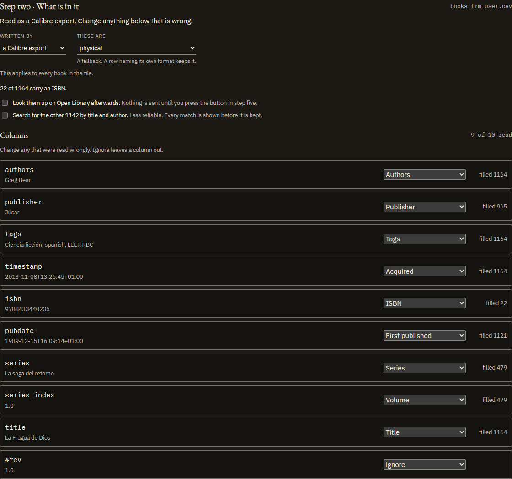
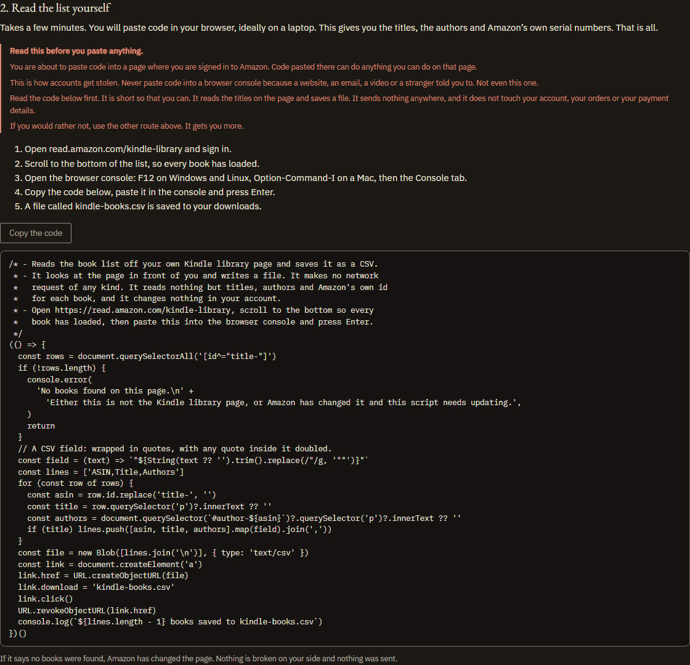

# Adding your books

Five ways in: a photograph, a list you already keep, a Kindle library, a barcode, or typing.

[← back to the README](../README.md)

---

#Adding your books

The opening page asks what you have rather than asking for your storage.
Arriving with nothing, there are three ways in: a photograph of a shelf, a list
you already keep, or the barcodes on the books themselves. Once there is a
catalog here, opening it and bringing one over from another device join them.

Whichever you pick sets up storage on the way, so choosing where the catalog is
kept is a decision you can make first if you want to and never have to make on
your own.

You need at least one source. Any one of these is enough on its own.

Every one of them ends in a list to check before anything is written, and any
single line of that list can be **discarded** on its own. Everything is kept
unless it is set aside.

### A photograph of a shelf

Photograph the shelf straight on at your camera's **full resolution**.

1. Open **Shelf picture** and choose the photo. It appears in the box you
   chose it from, and that box is also how to swap it for a different one. On a
   phone, **Take a photograph** beside the box opens the camera instead.

2. LibrAPP cuts it into pieces at full resolution. A close-up of a few books
   stays whole; a wide bookcase is split into several pieces. **Add row**, **Add
   column** and their opposites change the grid if the default does not suit
   your shelf.
    The key box at the top is optional and the page works without it. Everything up
    to this point has happened on your device: the photograph has been read, sized
    and cut, and nothing has been sent anywhere.
3. Check the pieces. Any that hold no readable spine, a wall, a lamp, the edge
   of a rug, can be **discarded**: they are not sent and not counted in the cost.
4. Read the pieces:
   - With an [AI key](ai-key.md): press **Read them**.
   - Without one: press **Copy the instructions**, save the pieces, and give
     both to any AI assistant. Bring back the JSON it writes.
5. Check what it read, then import.

**Step five takes the reply either way.** Drop the JSON file, or paste the text
straight into the box under it and press **Use this text**. It needs no key and
no photograph loaded, so coming back to it in a fresh tab works: it is the whole
of the keyless route's second half.

One piece here holds no readable spine and has been set aside. Discarded pieces
are not sent and not paid for, and **Keep** puts one back.

The checklist decides what is asked for beyond the titles, split into what is
printed on the spine and what the model would be recalling from elsewhere.
Anything recalled is marked on the book afterwards.

A long shelf is read in several requests rather than one, four pieces at a time,
and the button says which is running. One reply covering forty pieces is longer
than any model will return in one go, and a reply that runs out of room comes
back unreadable rather than short. If one of those requests fails, whatever the
others read is still offered, with the missing pieces named so a partial reading
is never imported as though it were the whole shelf.

Aim for pieces showing a handful of whole spines with the title readable top to
bottom. Adding **rows** splits titles in half, so only do that when the photo
really shows shelves stacked above one another.

Any piece holding no readable spine, such as a wall or a lamp, can be
**discarded** before the read. Discarded pieces are not sent, not saved and not
counted in the cost.

**What comes back is a list to check, not an import.** When the reading
finishes, the page says how many books came back and moves to the list, so a
read that takes a minute does not end on a page that looks unchanged. Nothing is
written until *Import these* is pressed, and any single book on the list can be
**discarded** first: a DVD case read as a book, a spine the model guessed at,
one wrong line in a reading that is otherwise right. Everything is kept unless
it is set aside, and the count on the button follows what is left.

### Asking for more than the titles

Under the pieces is a checklist of things to request beyond the titles, and it
divides into two kinds that are not interchangeable.

**Read from the photograph** — publisher, edition, the language on the cover,
series and volume. These are printed on the spine, so the model is transcribing
and the answer is evidence of the same kind as the title itself.

**Recalled by the model** — a genre, a short abstract, the year first
published, a reader rating, the original language, and the page count of a
typical edition. **None of this is in your photograph.** The model
produces it from what it was trained on, so it can be confidently wrong about a
real book. LibrAPP marks every book carrying such a field, shows the mark on the
book, and counts them before you import. The mark comes from which fields are
actually present, so a model cannot report a recalled abstract as something it
read.

Ticked boxes apply to both routes: the request sent with a key and the text the
copy button produces are the same string.

Cover images are not offered. A model replying with JSON can only return a link,
and fetching one would put a network request into an app that makes none, and
would tell whoever hosts that image which books you own.

The page count is worth a word of its own, because it is a number and numbers
look measured. It is the length of a typical edition of that work, not of the
copy in your picture. Nothing on a spine states a page count, so it is recalled
like the rest, and it is labelled that way wherever it appears.

A photograph shows a title, usually an author, sometimes a publisher. It cannot
show when you bought a book or whether you read it, so those stay blank until
another source fills them in.

Anything you do not tick here can be asked for later at the desk, for books
already in the catalog. See [Filling gaps](the-desk.md#filling-gaps-in-the-records).

### A list you already keep

Open **Upload list** and drop in a `.xlsx`, `.csv` or `.tsv` file.

Columns are matched by name in English, Spanish and German, so a sheet headed
`Autor / Título / Género` works as well as `author / title / genre`. Recognised
columns include title, author, genre, keywords, series, volume, publisher,
acquired date, read status, format and location. Unrecognised columns are
ignored.

**Step two says what it made of every column**, with a value out of your own
file beside each heading, and lets you point any of them at a different field or
leave it out. A column that is present and unrecognised looks nothing like a
column that is missing, which is the difference this step exists to show.

If a file holds more than one list, LibrAPP asks which one you want before
importing anything.

**The rows are shown before anything is written.** LibrAPP lists what it read
out of the file, and any row can be **discarded**: a header line that parsed as
a title, a wishlist entry sitting among books owned, anything in the sheet that
is not a book. Everything is kept unless it is set aside.

### Books on a Kindle

Amazon ships no export button, and for a lot of people the Kindle is the largest
collection they own. **[Books on a
Kindle](https://jesusjballesteros.github.io/LibrAPP/#kindle)**, on the front
page, gives two routes and says what each one costs.

**Ask Amazon for the data.** Account, then Data Privacy, then Request Your
Information. A download link arrives by email, usually within a few days. It
carries more than the other route, purchase dates included; its columns are not
recognised yet, so point them at the right fields in step two of Upload list.

**Read the list off the page yourself.** A short script, kept in
[`tools/kindle-library-exporter/`](../tools/kindle-library-exporter) and shown on
that page from the same file, saves the library page as a CSV. It makes no
network request and touches nothing but the page in front of it.

The page carries a plain warning about the second route, and it is meant
seriously: pasting code into a console on a site where you are signed in is how
accounts get stolen, and nobody should do it because a website asked. The code
is short so that it can be read first.

Either route gives you the title, the author and Amazon's own number for each
book. Not the purchase date, the read state, the page count or the ISBN. Step
five of Upload list can look some of that up afterwards, and finds more for
books in English than for books in other languages.

### Reading barcodes

The number under a barcode identifies the exact edition, so where **[Open
Library](https://openlibrary.org)** holds that edition there is nothing to guess
at: the title, the authors, the publisher, the year and the page count come back
as recorded facts. No AI, no key and no cost.

Open Library is a free catalogue run by the Internet Archive, and it is the one
service LibrAPP asks anything of. What it is sent is a list of ISBNs and nothing
else.

Paste the codes, one per line or out of a spreadsheet column, or read them from
a file. Hyphens, spaces and ISBN-10s are all fine, and the same book written as
a 10 and a 13 is looked up once.

**Or point the camera at them.** *Scan with the camera* opens a viewfinder and
reads codes as they pass in front of it, which is the quick way through a stack:
hold each book up, watch the count go up, move on. The same book twice counts
once. The camera is asked for only when you press it and handed back the moment
you stop, leave the page or switch tabs.

**Or photograph the barcodes.** Where the browser can read one, and Chrome on
Android can, **Read a barcode from a photo** takes one picture or several and
adds what it finds to the same box. A photograph of a pile gives up every code
in it, and a barcode that is not a book fails the same check a typo does. The
picture is read on the device at its own resolution and never leaves: shrinking
it would throw away the lines that carry the data, and there is nothing to save
by shrinking something that is not being sent.

Chrome on Android has a barcode reader built in and uses it. Desktop browsers
have none, so LibrAPP carries its own: about a megabyte of compiled decoder,
fetched the first time you scan something and not before. It is served from
LibrAPP itself, like the fonts, so scanning still makes no third-party request.
The page says which of the two is in use.

**What comes back is shown before any of it is kept**, for a reason worth
knowing. Asked for an ISBN it does not hold, the service answers with a
different book rather than with an error, so one wrong digit does not fail, it
succeeds wrongly and hands back a title with a publisher and a page count
attached. A code whose own check digit disagrees is refused before anything is
sent, which catches a mistyped or transposed digit, and you catch the rest by
reading the list.

A book already on your shelf takes the new details rather than becoming a second
entry: a lookup is a source like a photograph or a spreadsheet, and the same
merge applies. Anything that matched nothing is added. **The review says which
is which** before you keep anything, so a batch of thirty tells you how many are
new books and how many are gaps being filled. Any line of it can be
**discarded** on its own, so one wrong code among twenty right ones costs one
line rather than the batch.

Subjects come back as **keywords**, not as a genre. There are twenty to ninety
of them per book and they include things like *American literature* and *New
York Times reviewed*; calling one of them the genre would be the app choosing
rather than recording.

### Typing a book in

Press **Type a book in** from the catalog for anything the other sources cannot
see — a gift, a borrowed book, something read but not owned.

Typed entries merge with the same book from other sources rather than
duplicating it.
